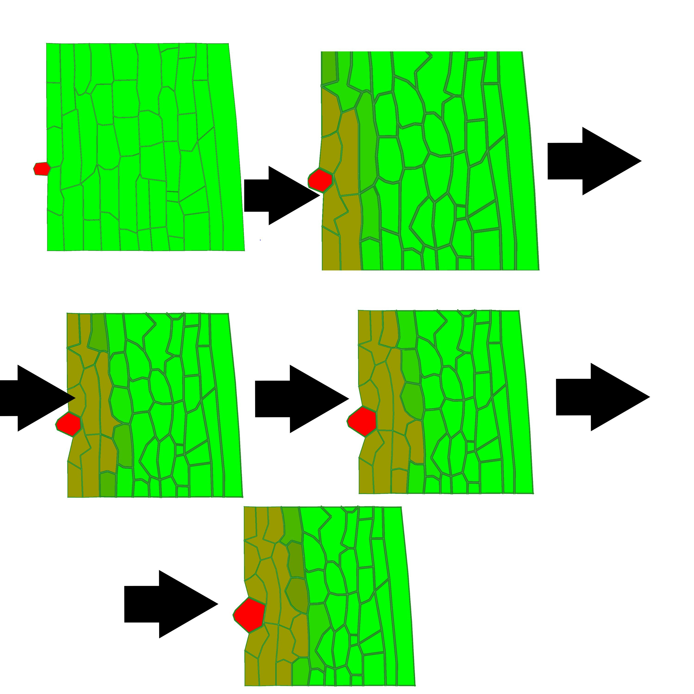
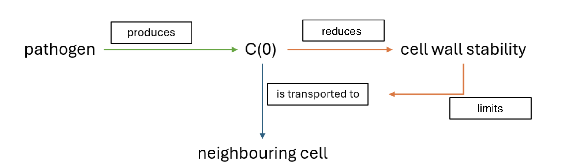

# General Information
This is the GitHub repository of Group 4 

# Assignment 1: Metabolic Modeling (E. coli Core)
 In this assignment, we work with the E. coli core metabolic model using COBRApy in Python. Our goal is to see how gene expression data can affect the model by using it as a proxy for the maximum activity of certain reactions.  
We first visualize the gene expression data on the E. coli core map and then use it to set new flux bounds for the reactions. After building the constrained model, we run Flux Variability Analysis to find the possible flux ranges for all reactions. Lastly, we perform Flux Balance Analysis to calculate the maximum biomass production rate and figure out which reactions are acting as bottlenecks for growth.  
## Files

- `Assignment1_Notebook.ipynb` – main notebook (Exercises 1–4)
- `e_coli_core.json` 
- `e_coli_core_expression.csv` 

# Assignment 2: Epidemiological Model Parameter exploration
 In this assignment, we implement a SIRD function. We then use this to explore two different epidemiological scenarios.
 Our goal is to see how these parameters influence the outcome of an epidemic in terms of total infections, deaths and epidemic peak.
 At the end we analyse the effects of an intervention and discuss how effective such an intervention would be in real life.
 
## Files

- `Assignment2.ipynb` – main notebook (Exercises 1–3)

# Assignment 3: Network Biology
This assignment involves an analysis of cancer-causing mutations using Boolean networks, building upon the provided notebook. We model four distinct mutations in a cell's regulatory network, in addition to the normal network. Each mutation simulates a common cancer-related pathway disruption: a p53 knockout, which eliminates a key tumor suppressor; an MYC amplification which causes an oncogene to be always active; an MDM2 overexpression, which disrupts the p53 pathway; and a mutation that always results in the death of the cell. We perform a scenario analysis and test how the network responds to these conditions. Additionally, we identified all stable states the network can reach and determined the percentage of initial states that lead to a "cancer-like" outcome. This will allow for a comparative study of how each mutation changes the network's dynamics.

### Which mutation is most dangerous?
From the data we have gathered, mutation A, or the p53 Knockout (always OFF) seems the most dangerous. B and C are also highly oncogenic but A is even more due to the following reasons: 

scenario outcomes end in profileration/oncogenic states only(no apoptosis):
• healthy -> growth=1, death=0
• stressed (DNA_damage=1) -> growth=1, death=0 <- cancer-like
• oncogene hijacked -> growth=1, death=0

When we consider the attractors: A has 2 attractors and both are cancer-like (proliferation, oncogenic). 

Speed to malignant state: In the stressed scenario A reaches the cancer-like steady state in 4 steps, whereas B/C take 7. Faster convergence means less opportunity for recovery/repair.

Comparison to baseline: Normal has 3 attractors with the split being ≈ 50.0% Proliferation, 46.9% Apoptosis, 3.1% Oncogenic (so about ≈ 53.1% cancer-like overall). Mutation A removes the apoptotic ending entirely and leads to cancer-like situations only.

### What is the role of Feedback loops?
Feedback loops are regulatory circuits where the output of a process influences its own activity, either amplifying it (positive feedback) or dampening it (negative feedback).  These loops allow cells to dynamically adapt to internal and external changes. For example, in the MYC → MDM2 → p53 loop, MYC promotes MDM2, which suppresses p53 and keeps growth active. p53 can in turn regulate MYC and MDM2, forming a negative feedback loop that maintains controlled cell growth.

### What are the limitations?
First, the model does not consider all real world cell outcomes such as Senescence. By excluding alternative destinations, the model can only funnel initial states toward the 3 attractors proliferation, oncogenic growth and apoptosis, thus presenting an incomplete and potentially misleading picture of the cell's potential long-term behaviors.

The second limitation is the model’s binary setup and the logic operators it uses, which oversimplify biology. It does not consider continious concentration thresholds and gradual responses and therefore the cell either ignores stress or dies, without considering repair mechanisms or partial arrest that real cells use for actual outcome decisions. In addition, the AND, OR and NOT operators neccessarily reduce the models accuracy of the cells non-linear behaviour.

Lastly, a limitation related to the previous point, the model lacks nuanced temporal dynamics. Although it updates in discrete steps, it cannot represent variable durations, delays, or commitment points. This limits its ability to capture when a cell recovers, pauses, or irreversibly commits to arrest or death.

## Files

- `Assignment3.ipynb` – main notebook (Building and analysing a network with mutations)

# Assignment 4: Plant Systems Biology
This assignment is an investigation into a computational model of a plant-pathogen infection, where the pathogen facilitates its spread by secreting a chemical that degrades cell wall stability. We analyze and interpret the model's existing structure through simulation, code review, and pseudocode. 

### Task 1

Running the simulation we observe that the pathogen rapidly attacks the cell walls in the first hour and is able to weaken a lot of them.
We can see deformation on the infected cells due to a loss of sturctural integrity caused by the wall weaking chemicals. The pathogen is able to penetrate deeper into tissue.
After the 2nd hour the infection slows down but the pathogen is still steadily growing and infecfting more cells.

### Task 2

CellHouseKeeping is called on each cell at every step of the simulataion. It governs how the cells behave, for example how they grow and how they respond to chemichals. If cell is a pathogen (type 2) its target area is increased, simulating the faster expansion of a pathogen.
The function sets the base length of wall elements to 25 units. It also measures the level of pathogen chemicals in the cell and limits it's maximum effect. If the pathogen chemical level is too high stiffness is reduced to simulate weaker walls. Otherwise the stifness is kept at a default of 2.5.

### Task 3

### Task 4
Decrease:
The chemical stays localized near the pathogen and the gradient is steeper. There is very high C(0) next to the pathogen and it quickly drops a few cells away. The infection advances slowly and the soft/weak region is small. At the end only a small patch remains

Increase:
The chemical spreads much farther from the source. More distant cells recieve a low C(0) so more cells show some weakening earlier. Local concentration near the pathogen is lower and the nearest walls can be less damaged than in the decrease scenario but the area of compromised walls is larger and it progresses faster

### Task 5
We can add one new mechanism

S – defense signal produced by healthy cells when they detect the pathogen chemical C0

Right after infection, healthy cells that detect the pathogen chemical above a small threshold begin secreting the defense signal S. It then diffuses to neighboring cells to help them and decays gradually. In regions where S is present walls become both stiffer and less sensitive to C0 weakening effectso the infection advances more slowly. Changing the size of the effects (ALPHA_STIFF, BETA_C0) will determine how much it stops any infection

### So we have some paramenters that it operates with

    THRESHOLD_DETECT = 0.2     # C0 level that triggers S production
    
    K_SECRETE_S      = 0.05    # how fast an active cell adds S 
    
    D_S               = 0.02   # diffusion coefficient of S
    
    K_DECAY_S         = 0.01   # how much S decays per hour
    
    ALPHA_STIFF       = 0.5    # stiffness boost from S
    
    BETA_C0           = 0.4    # reduction of C0 weakening effect by S
    
    S_HALF            = 0.30   # S level that gives half of the defense effect

### this will be in CellHouseKeeping

we read the current local concentrations

    c = cell.C0
    
    s = cell.S

cells detect C0 high and make S

    if cell.type == HEALTHY and c > THRESHOLD_DETECT:

    cell.S += K_SECRETE_S * dt

Then stiffness is computed with defense and the weakening from C0 applies

    C_effect      = c                       //C effect
    S_effect      = HILL(s, S_HALF)        //S effect 
    C_effect_mod  = C_effect * (1 - BETA_C0 * S_effect)   //how strong is C weakening effect
    stiff_from_C  = stiffness_base * f_weak(C_effect_mod)  //weakening of the cell from C
    boost         = (1 + ALPHA_STIFF * S_effect)  //boosting of the cell from S
    cell.stiffness = stiff_from_C * boost    //final cell stiffness 

### then this will be in the transport step to spread it and dissapear

    Diffuse(C0, D_C) 
    
    Diffuse(S,  D_S)
    S -= K_DECAY_S * S * dt

---

# Assignment 5: Modeling in Neuroscience

### Task 2
Human 

Ventral:
V1, V2, V4, Lateral occipital complex, Fusiform gyrus, IT
Dorsal:
V1, V2, V3A, V5e, MST, Intraparietal sulcus

Monkey

Ventral:
V1, V2, V4, TEO, TE, IT
Dorsal:
V1, V2, V3, V5, MST, LIP

Marmoset

Ventral: 
V1, V2, V4, TEO, TE, Inferotemporal-like cortex
Dorsal: 
V1, V2, V5, MST, LIP, Posterior parietal cortex
